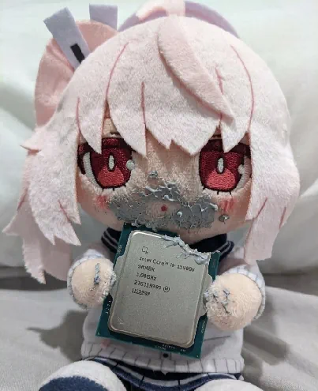

In order for the installed libraries to work properly in the main project, you must set the `OBSNOTIF_DEPS_INSTALL_DIR` variable.
Alternatively, add this project as a `subdirectory` and the required variable will be set automatically.
